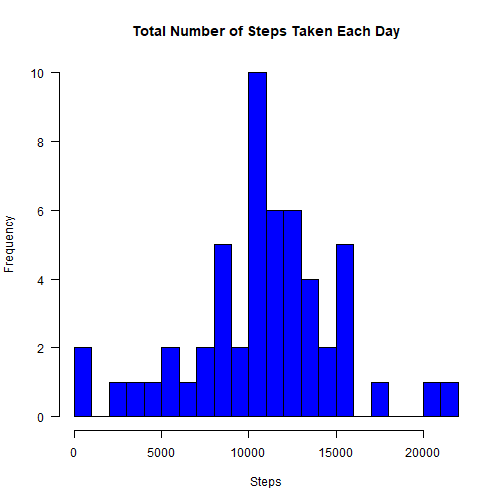
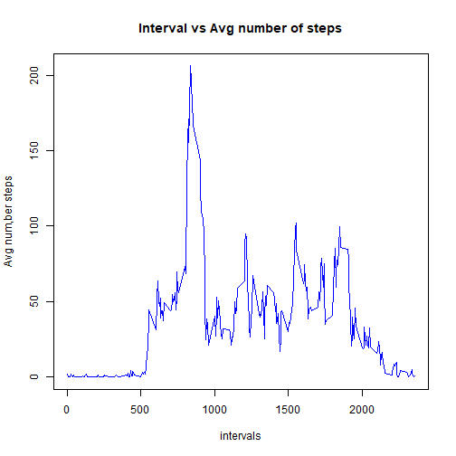
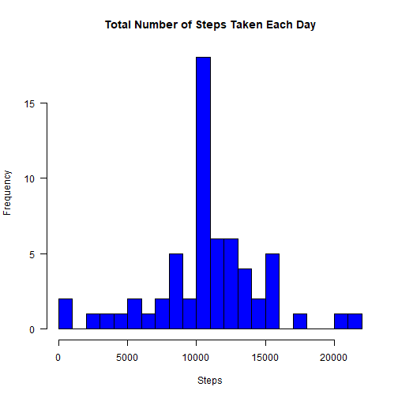
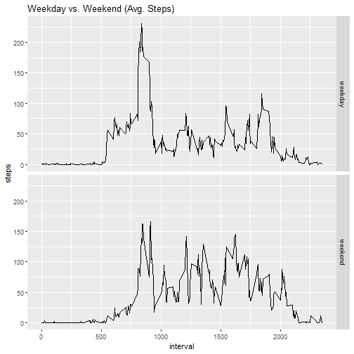

## Loading and preprocessing the data


```r
#Set the working directory
setwd("C://data_science//Reproducible Reasarch//proj")
#Read file
activity<-read.csv("activity.csv")
```

## What is mean total number of steps taken per day?


```r
# 1.Calculate the total number of steps taken per day.
total_steps_per_Day<-aggregate(steps~date,activity,sum, na.rm=TRUE)
head(total_steps_per_Day,5)
```

```
##         date steps
## 1 2012-10-02   126
## 2 2012-10-03 11352
## 3 2012-10-04 12116
## 4 2012-10-05 13294
## 5 2012-10-06 15420
```

```r
# 2. If you do not understand the difference between a histogram and a barplot, research the difference between them. Make a histogram of the total number of steps taken each day.

par(mfrow = c(1, 1))
# use base plotting system 
hist(total_steps_per_Day$steps, breaks = 25, 
     main = "Total Number of Steps Taken Each Day",
     col = "blue", xlab = "Steps", axes = FALSE)
axis(1)
axis(2, las = 1)
```



```r
# 3. Calculate and report the mean and median of the total number of steps taken per day.

mean(total_steps_per_Day$steps)
```

```
## [1] 10766.19
```

```r
median(total_steps_per_Day$steps)
```

```
## [1] 10765
```

## What is the average daily activity pattern?


```r
# Make a time series plot (i.e. type = "l") of the 5-minute interval (x-axis) and the average number of steps taken, averaged across all days (y-axis).

interval_mean<-aggregate(steps~interval,activity,mean, na.rm=TRUE)

plot(interval_mean$interval, interval_mean$steps, type="l", col="blue", xlab="intervals", ylab="Avg num,ber steps", main="Interval vs Avg number of steps")    
```



```r
#Which 5-minute interval, on average across all the days in the dataset, contains the maximum number of steps?
```


## Imputing missing values


```r
#1.Calculate and report the total number of missing values in the dataset (i.e. the total number of rows with NAs).

#sapply(activity, function(x) sum(is.na(x)))

x<-sum(is.na(activity$steps))
paste("Total number of missing is ", x)
```

```
## [1] "Total number of missing is  2304"
```

```r
#2.Devise a strategy for filling in all of the missing values in the dataset. The strategy does not need to be sophisticated. For example, you could use the mean/median for that day, or the mean for that 5-minute interval, etc.


#We will be using the mean 5-minute iunterval to update NA values.

#3. Create a new dataset that is equal to the original dataset but with the missing data filled in.

for (i in 1:length(activity$steps)){
        if (is.na(activity$steps[i] == TRUE)){        
        activity$steps[i] <- interval_mean$steps[match(activity$interval[i], interval_mean$interval)]  
        } 
}

#4. Make a histogram of the total number of steps taken each day and Calculate and report the mean and median total number of steps taken per day. Do these values differ from the estimates from the first part of the assignment? What is the impact of imputing missing data on the estimates of the total daily number of steps?

#Redo as earlier, but now the activity dataframe has no nulls

total_steps_per_Day<-aggregate(steps~date,activity,sum)

mean(total_steps_per_Day$steps)
```

```
## [1] 10766.19
```

```r
median(total_steps_per_Day$steps)
```

```
## [1] 10766.19
```

```r
par(mfrow = c(1, 1))
# use base plotting system 
hist(total_steps_per_Day$steps, breaks = 25, 
     main = "Total Number of Steps Taken Each Day",
     col = "blue", xlab = "Steps", axes = FALSE)
axis(1)
axis(2, las = 1)
```



#### Looks like graphs are similar in shape but the range 10k to 11k steps has increased in frequency after updating the null values.

## Are there differences in activity patterns between weekdays and weekends?


```r
# 1. Create a new factor variable in the dataset with two levels - "weekday" and "weekend" indicating whether a given date is a weekday or weekend day.


activity<-cbind(activity, datetype = ifelse(as.POSIXlt(activity$date)$wday %in% c(0,6), 'weekend', 'weekday'))


activity<-aggregate(steps~interval+datetype, activity, mean, na.rm=TRUE)

# 2.   Make a panel plot containing a time series plot (i.e. type = "l") of the 5-minute interval (x-axis) and the average number of steps taken, averaged across all weekday days or weekend days (y-axis). See the README file in the GitHub repository to see an example of what this plot should look like using simulated data.

library(ggplot2)

ggplot(data = activity, aes(x = interval, y = steps))+
  facet_grid(datetype ~ .)+
  geom_line()+
  ggtitle("Weekday vs. Weekend (Avg. Steps)")
```



### Looks like the individual is more active in the morning during weekdays, and less active during the afternoon  hours. As far as the weekends, looks like the individual is less active in the morning, and that's probably explained to the fact that many people wake up later in morning on weekends.

